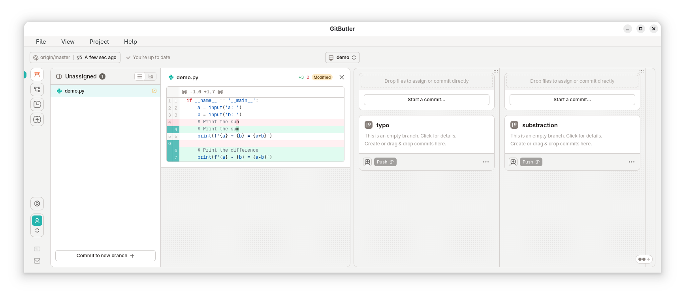
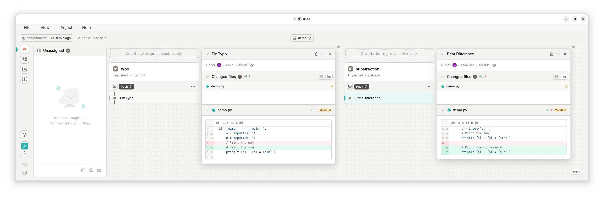
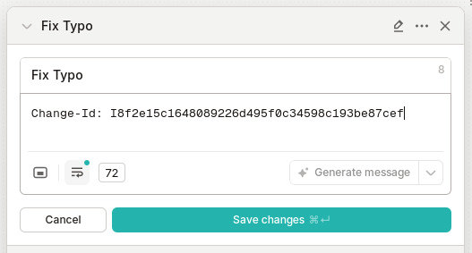
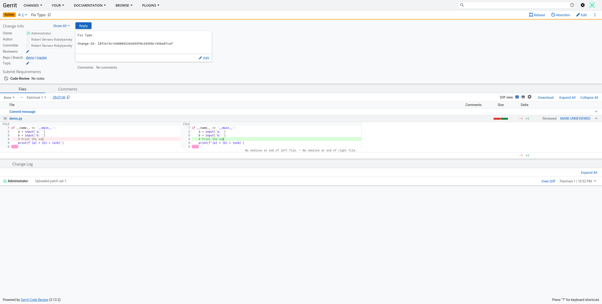

+++
title = "Using GitButler with Gerit in 2025"
date = 2025-09-14
+++

GitButler is a Git client that let's you work on simultaneous branches very intuitively. This is very useful where you might be working on a feature, and need to make a small fix here or there.

I have been using GitButler daily at my job for the last two weeks and it has proven very useful. For example, I was recently working on scripts for analyzing performance data. While I was working on the data analysis scripts, I also made some quality of life changes to our performance test execution framework. These changes were independent of each other. Usually, one might create two branches and switch between them during development. However, with GitButler it's nice to have the quality of life changes simultaneously while I worked on the data analysis.

Our team uses Gerrit for code review. GitButler doesn't work out of the box with Gerrit. There's two things I had to do to make it work.



Let's take this demo as an example. We're adding a feature to print the difference of the numbers, but also fixing a small typo. They're both independent changes, but it would be nice to not have to stare at the typo all the time while working on the new feature. One of the neat things about having these as independent changes is that during code review you can quickly get smaller changes merged while working on a larger change. So we create two independent "virtual branches". And drag the spans respectively into them.



Now we have two independent commits. One fixing the typo, and another one adding the substraction. Usually, to push to Gerrit, one would use:

```bash
git push HEAD:refs/for/master
```

However, when using GitButler, you have to use the name of the virtual branch you want to push.

```bash
git log --all --graph --oneline
*   6e18858 (HEAD -> gitbutler/workspace) GitButler Workspace Commit
|\
| * edd99c0 (substraction) Print Difference
* | 9f959e6 (typo) Fix Typo
|/  
* 0140052 (origin/master, origin/HEAD) Print Sum
* ac1fa03 (gitbutler/target) Initial empty repository
```

Conveniently, the "virtual branches" in GitButler are actually real branches that all get merged into a workspace branch. So, you can just use the same name as you used to name the virtual branch in the GUI.

```bash
git push origin typo:refs/for/master
```

But wait! We're missing a `Change-Id:`. GitButler does have an option in the settings to run commit hooks. But so far in my testing the Gerrit commit hook doesn't really work with GitButler. Thankfully, Gerrit doesn't really care how we generate the `Change-Id`, only that it follows the syntax and it's unique.

```bash
echo "Change-Id: I$(head -c 20 /dev/urandom | sha1sum | awk '{print $1}')"
```

Here's a one-liner that *Just Works™* on Linux. Thanks ChatGPT!



Just ammend the commit message with the random `Change-Id`.

```bash
git push origin typo:refs/for/master
```

And push your virtual branch as a change to Gerrit.



Ready! You can push each virtual branch as an independent change to Gerrit while working on them simultaneously thanks to GitButler.

## TLDR

1. Instead of the usual `git push origin HEAD:refs/for/master`, you have to use the name of the virtual branch. `git push origin typo:HEAD/refs/for/master`.
2. Gerrit's commit hook may not work. Use `echo "Change-Id: I$(head -c 20 /dev/urandom | sha1sum | awk '{print $1}')"` to generate a random `Change-Id` and ammend it to the commit message through the GitButler GUI or the Git CLI.